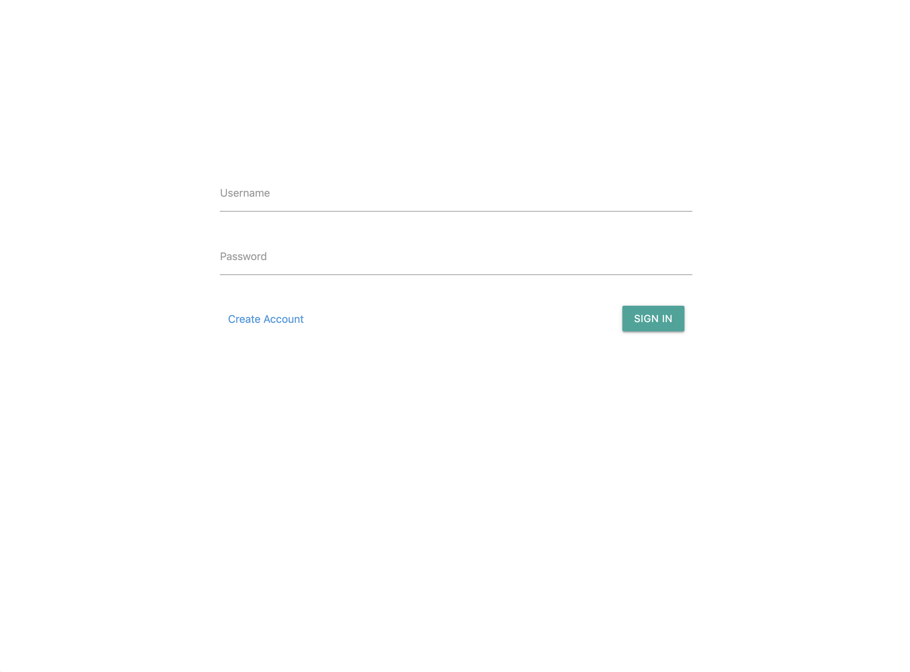

## WeMail
This is a mock email server that replicates the functionality of an email server without setting up an SMTP server. Therefore, the scope of the project is limited to delivering email to accounts created on this server.

The link to the site is [here](http://master.d16zkzf5ymnoc6.amplifyapp.com)

## Motivation
This project exists for me to review/learn the several frameworks and technologies listed below (Django, React, AWS). It also serves as a basic reference for me in the future and others that might find it useful to see how these frameworks and technologies go together.

## Screenshots



## Framework/Technologies
- [Django](https://www.djangoproject.com/)
- [Django REST framework](https://www.django-rest-framework.org/)
- [React](https://reactjs.org/)
- [Postgresql](https://www.postgresql.org/)
- [gunicorn](https://gunicorn.org/)
- [Amazon EC2](https://aws.amazon.com/ec2/)
- [Amazon S3](https://aws.amazon.com/s3/)

## Features
- Create secure account on server using JWT tokens for authentication
- Send emails to others on the server by reading and writing from Postgresql
- Attach files to emails which is stored on Amazon S3

## Installation
1. Make sure python 3 is installed.
```bash
$ python3 --version
Python 3.7.0
```
2. Install virtualenv if you don't have it and create a virtual environment.
```bash
$ pip install virtualenv
```
```bash
$ python3 -m venv /path/to/new/virtual/environment
```

3. Activate the virtual environment
```bash
$ source mypython/bin/activate
```
4. Install all the dependencies
```bash
$ pip install django
$ pip install djangorestframework
$ pip install psycopg2
$ pip install djangorestframework
$ pip install djangorestframework-jwt
$ pip install django-cors-headers
```
5. Have Postgresql set up and make migrations
```bash
$ python manage.py migrate
```
6. Start server and manage server from a browser at "http://127.0.0.1:8000/emails/admin"
```bash
$ python manage.py runserver
```

## Road Map
- Be able to send grouped emails
- Be able to send emails to other domains
- Be able to receive emails from other domains
